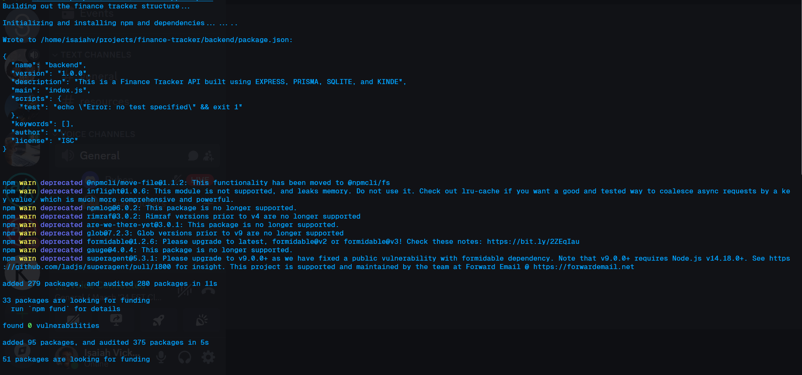
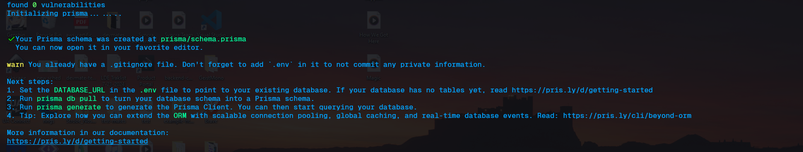
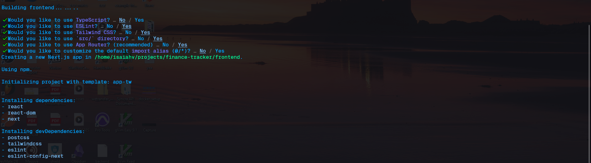
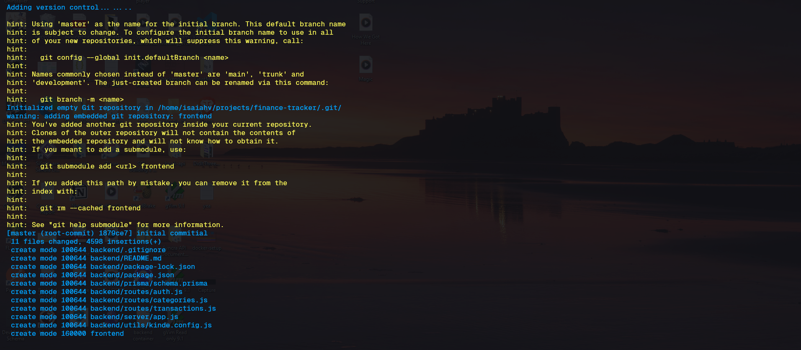

# Build a Finance Tracker (Setup Folder only)

This is a Finance Tracker API built using Express, Sequelize, SQLite, and Kinde. This will help you set up the folder structure that was used to build this project. Follow the instructions carefully.

## Project Setup

There are 2 ways to get started with this project:

## OPTION 1 - via Curl `recommended`

### 1. Open your terminal and navigate to where you store your projects (if not the home directory)
### 2. Once there, copy and paste the following command based on your terminal

```bash
curl -sL https://github.com/izzymadethat/finance-tracker-setup/raw/main/setup.sh | bash
```

_The following command builds and run our entire folder setup without needing to setup the folders yourself or needing to clone this repo._

### 3. Follow along with me and let's get started!
[](https://youtube.com/playlist?list=PLjmmSe-da5oq81O_LOQDgm8mUrfgBrz6_&si=IbJZxBmAFAYJz9rO)


## Option 2 - via Cloning the Repo **_(PLEASE READ CAREFULLY)_**
### 1. Clone the Repository

Clone this repo to your local machine (place wherever you normally put your projects):

`via HTTPS:`

```bash
git clone https://github.com/izzymadethat/finance-tracker-setup.git finance-tracker-setup
```

`via SSH:`

```bash
git clone git@github.com:izzymadethat/finance-tracker-setup.git finance-tracker-setup
```

### 2. `CD` into the folder you plan on building the Project from (Do NOT build in setup folder)

```bash
cd ../../<to your desired destination folder>
```

### 3. Make the script executable

This project folder only has the setup script to build out the entire folder structure. To make it executable, run:

```bash
chmod +x <PATH>/<TO>/finance-tracker-setup/setup.sh
```

### 4. Finally, execute the script and follow the prompt:

```bash
bash <PATH>/<TO>/finance-tracker-setup/setup.sh
```

## Building the Backend

### 5. The script will run, create the necessary folders, and initialize the backend




## Building the Frontend

### 6. The script will now run the commands to build your frontend directory using the latest version of [Nextjs](https://nextjs.org/docs). When prompted, use your left or right arrow keys to answer the configuration questions then press `enter/return`. Your results should look like this:



## Using `git` for version control

So that you can keep track of your changes, I've automatically scripted in your git commands! So change you make can be added to your repository (Of course you'll setup adding it to Github)


## STEPS COMPLETE! Press _'`Y`'_ then `enter/return` to start coding (opens in VSCode)

You can view the folders to check what has been installed. Your folder structure should look similar to this:

_note: the folder name `finance-tracker` will be created for you._

```bash
./ Folder where your projects are
finance-tracker
├── backend
│   ├── .env
│   ├── README.md
│   ├── database
│   ├── node_modules
│   ├── package-lock.json
│   ├── package.json
│   ├── prisma
│   │   └── schema.prisma
│   ├── routes
│   │   ├── auth.js
│   │   ├── categories.js
│   │   └── transactions.js
│   ├── server
│   │   └── app.js
│   └── utils
│       └── kinde.config.js
└── frontend
    ├── .env
    ├── README.md
    ├── jsconfig.json
    ├── next.config.mjs
    ├── package-lock.json
    ├── package.json
    ├── postcss.config.mjs
    ├── postcss.config.mjs
    ├── node_modules
    ├── public
    │   ├── next.svg
    │   └── vercel.svg
    ├── src
    │   └── app
    │       ├── favicon.ico
    │       ├── globals.css
    │       ├── layout.js
    │       └── page.js
    └── tailwind.config.js

11 directories, 22 files
```

### If so, then we're ready to get started with building our Project!
[](https://youtube.com/playlist?list=PLjmmSe-da5oq81O_LOQDgm8mUrfgBrz6_&si=IbJZxBmAFAYJz9rO)
